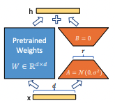
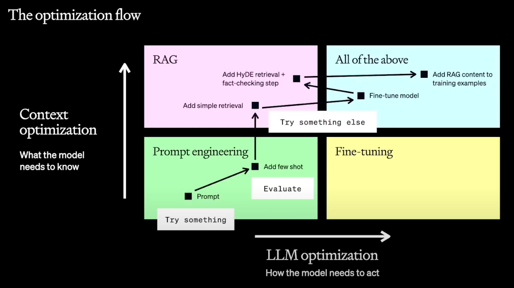

# LoRA: Low-Rank Adaption of LLM

- 모델에 다운스트림 태스크를 적용하기 위해서는 fine-tuning이 필요하다.
- LLM 모델을 fine-tuning을 적용하기에는 비용이 너무 크다.
- 거대 모델에 fine-tuning을 적용하기 위해 PEFT(Parameter Efficient FT) 사용
- 원본 모델의 파라미터는 고정 시키고 레이어를 추가하는 방식으로 일부 업데이트
- 그 중 LoRA는 저차원 행렬을 추가해 학습한다.

### LoRA



- 입력 행렬(1 x d)
- 학습할 가중치 행렬 2 x r x d (d x r, r x d)
- 추가된 두개의 행렬을 학습한다.
- d: 512 이상, r: 2 ~ 16

### Code example

```bash
# torch gpu included / jupyter is optional
pip install transformers peft jupyter

# or just
pip install -r requirements.txt
```

### PS



- RAG과 FT의 관계
  - 모델의 지식적인 측면 수정 RAG
  - 모델의 답변과 추론과정을 수정 FT
- 요즘 나오는 LLM 모델은 성능이 많이 향상되서 굳이 FT 안해도 되는 경우도 많음

출처: https://developerahjosea.tistory.com/entry/LoRA-%EC%9D%B4%EB%B2%88%EB%A7%8C%ED%81%BC-%EC%99%84%EB%B2%BD%ED%95%98%EA%B2%8C-%EC%9D%B4%ED%95%B4%ED%95%B4%EB%B3%B4%EC%9E%90-with-%EC%8B%A4%EC%8A%B5-%EC%BD%94%EB%93%9C
